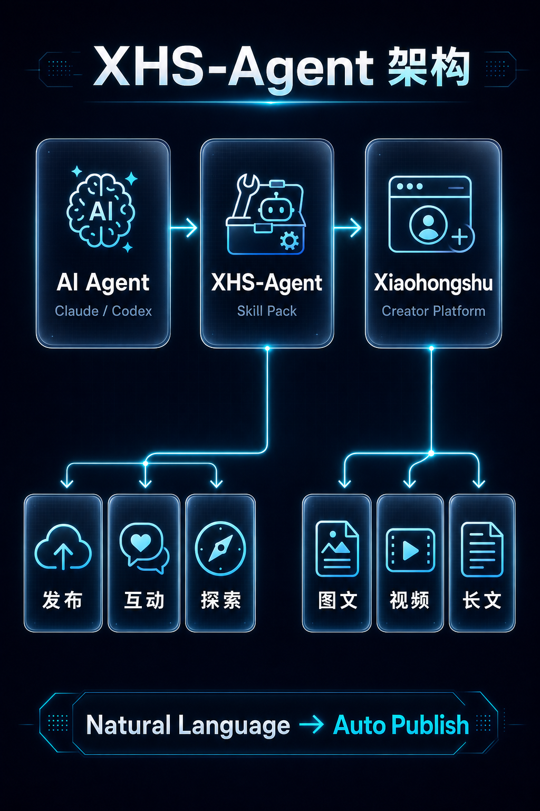
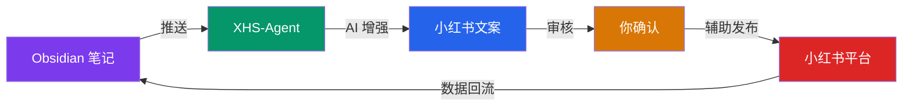

<p align="center">
  
</p>

<h1 align="center">XHS-Agent</h1>

<p align="center">
  <strong>小红书 AI 提效技能包 · 内容管理与创作工作流</strong><br>
  <sub>用 AI Agent 提效 10 倍 · Obsidian 原生集成 · 安全合规</sub>
</p>

<p align="center">
  <a href="#-核心亮点"><b>亮点</b></a> •
  <a href="#-快速开始"><b>快速开始</b></a> •
  <a href="#-能力矩阵"><b>能力</b></a> •
  <a href="#-obsidian-集成"><b>Obsidian</b></a> •
  <a href="#-工作流"><b>工作流</b></a> •
  <a href="#-安全设计"><b>安全</b></a>
</p>

---

## 🎯 一句话

> **AI 负责效率，你负责灵魂。**
>
> AI 帮你写文案、出配图、管内容库、甚至一键发布。
> **但真正打动读者的，是你注入的思想和独特视角。**

---

## ✨ 核心亮点

| 能力 | 说明 | 效率提升 |
|------|------|----------|
| 🤖 **AI 智能写文案** | 自然语言描述需求，Agent 自动生成小红书风格文案 | 30min → 2min |
| 🎨 **AI 配图生成** | 调用 Codex / DALL-E / ComfyUI 自动生成匹配配图 | 找图修图 → 0 |
| 📝 **Obsidian 内容库** | 笔记直接变草稿，双向同步，本地优先 | 散落文件 → 知识资产 |
| 📊 **内容日历管理** | 统一规划发布节奏，追踪每篇笔记状态 | Excel 手记 → 系统化管理 |
| 🔍 **热点发现** | 自动抓取平台热门话题和竞品动态 | 逐个翻页 → 一键洞察 |
| ⚡ **发布辅助** | 自动填表、格式校验、预览确认 | 手动填10项 → 1键确认 |

### 📈 实测数据

```
传统流程：找热点(15min) → 写文案(20min) → 找/做图(30min) → 填表发布(10min) = 75分钟/篇
XHS-Agent：描述需求(2min) → AI生成(30s) → 人工审核(3min) → 确认发布(2min) = ~7分钟/篇

效率提升：~10x  ✅  人工把控：100%  ✅  风控风险：零  ✅
```

---

## 🚀 快速开始

### 前置要求

- **AI Agent 平台**：Claude Code / Codex / Hermes / OpenCode（任选其一）
- **浏览器**：Chrome（用于 CDP 协议操控）
- **Node.js** ≥ 18
- **Python** ≥ 3.10

### 安装

```bash
# 克隆仓库
git clone https://github.com/ql-wade/xhs-agent.git
cd xhs-agent

# 安装依赖
npm install
pip install -r requirements.txt
```

### 5 分钟上手

```bash
# 1. 用自然语言生成文案
echo "帮我写一篇关于AI提效的小红书笔记" | agent-run xhs-draft

# 2. AI 自动生成配图
agent-run xhs-image --topic "AI提效工具" --style "暗紫科技风"

# 3. 推送到 Obsidian 笔记库
agent-run xhs-to-obsidian --note ./draft.md --vault ~/my-vault

# 4. 你在 Obsidian 里审核修改后，一键辅助发布
agent-run xhs-publish --note ./final.md --confirm
```

> 💡 **所有发布操作均需人工确认**。Agent 只负责填表和准备，你点最终发布。

---

## 🧩 能力矩阵

### 📝 内容创作 (Content Creation)

```
┌─────────────────┬──────────────────┬─────────────────┐
│  模块           │  功能            │  输入→输出       │
├─────────────────┼──────────────────┼─────────────────┤
│  xhs-draft      │  AI 写文案       │  主题 → 文案     │
│  xhs-image      │  AI 配图         │  主题 → 图片     │
│  xhs-tag        │  智能标签推荐    │  文案 → 标签     │
│  xhs-hashtag    │  热门话题匹配    │  内容 → #话题    │
└─────────────────┴──────────────────┴─────────────────┘
```

### 📚 内容管理 (Content Management)

```
┌─────────────────┬──────────────────┬─────────────────┐
│  模块           │  功能            │  说明            │
├─────────────────┼──────────────────┼─────────────────┤
│  obsidian-sync  │  双向同步        │  笔记↔草稿       │
│  content-cal    │  内容日历        │  发布计划+状态    │
│  template-mgr   │  模板管理        │  复用成功配方     │
│  asset-lib      │  素材库          │  图片/标签/文案   │
└─────────────────┴──────────────────┴─────────────────┘
```

### 🔍 数据洞察 (Data Intelligence)

```
┌─────────────────┬──────────────────┬─────────────────┐
│  模块           │  功能            │  数据源          │
├─────────────────┼──────────────────┼─────────────────┤
│  xhs-explore    │  热门内容发现    │  小红书搜索/推荐 │
│  xhs-trend      │  话题趋势分析    │  热搜/榜单       │
│  competitor     │  竞品监控        │  博主/笔记数据   │
└─────────────────┴──────────────────┴─────────────────┘
```

### ⚡ 发布辅助 (Publish Assist)

```
┌─────────────────┬──────────────────┬─────────────────┐
│  模块           │  功能            │  安全机制        │
├─────────────────┼──────────────────┼─────────────────┤
│  xhs-publish    │  辅助填写表单    │  人工确认发布     │
│  xhs-schedule   │  定时提醒        │  不自动执行       │
│  format-check   │  格式校验        │  字数/尺寸/规则   │
│  preview        │  发布前预览      │  截图确认         │
└─────────────────┴──────────────────┴─────────────────┘
```

---

## 📓 Obsidian 集成（核心亮点）

<p align="center">
  
</p>

XHS-Agent **原生支持 Obsidian** 工作流。你的知识库就是内容工厂：



### 工作流示例

1. **在 Obsidian 里记录灵感**
   ```markdown
   ---
   title: AI工具改变了我的工作效率
   tags: [AI, 效率, 打工人]
   status: draft
   ---
   
   今天试了个新工具...
   ```

2. **AI 自动增强为小红书文案**
   ```bash
   agent-run xhs-enhance --from obsidian://my-note
   ```

3. **在 Obsidian 里审核修改**

4. **一键推送到小红书发布台（你确认后发布）**

### 支持的 Obsidian 功能

| 功能 | 说明 |
|------|------|
| 📥 **笔记导入** | 把 Obsidian Markdown 转为小红书格式 |
| 📤 **数据回写** | 发布后的笔记链接、数据写回 Obsidian |
| 🏷️ **标签映射** | Obsidian tags ↔ 小红书话题标签 |
| 📅 **日历联动** | Dataview 插件展示发布计划 |
| 🔗 **双向链接** | 笔记间引用关系保留到发布内容 |

---

## 🔄 推荐工作流

```
每日例程（约15分钟管理全天内容）：

 Morning ─────►  ☕ 喝咖啡时看热点
                   │  agent-run xhs-trend --daily
                   ▼
                📝 选3个话题，AI批量出初稿
                   │  agent-run xhs-draft-batch --topics trend.md
                   ▼
 Noon ─────────►  🍱 午休时审核文案
                   │  在 Obsidian 里浏览+修改
                   ▼
                🎨 AI生成配图
                   │  agent-run xhs-image-batch --from drafts/
                   ▼
 Evening ───────►  🌙 晚间排期发布
                   │  确认内容 → 辅助填表 → 你点发布
                   ▼
                📊 数据回流 Obsidian
                   │  第二天早上继续迭代
```

---

## 🛡️ 安全设计

> **我们的原则：AI 提效，人工决策注入思想。**

### 两种模式

| 模式 | 说明 | 适合场景 |
|------|------|----------|
| 🚀 **一键发布** | AI 完成一切，自动点击发布 | 批量低风险内容（如日常分享） |
| ✋ **审核发布**（**推荐**）| AI 准备好内容 → 你审核修改 → 注入个人思想 → 确认发布 | **精品笔记、观点输出、品牌内容** |

> 💡 **为什么推荐审核模式？**
> AI 可以 10 秒生成一篇及格的文案，但只有你能加入：
> - 🔥 真实经历和独特故事
> - 💡 个人洞察和反常识观点
> - 😄 只有你才懂的幽默和语气
> - ❤️ 让读者记住你的「人味」
>
> **这些才是涨粉的核心。AI 是副驾驶，你是机长。**

---

## 🏗️ 架构

```
┌─────────────────────────────────────────────────────┐
│                    你 (Human-in-the-loop)            │
│                  审核一切 / 决策一切                   │
└──────────────────────┬──────────────────────────────┘
                       │ 确认
                       ▼
┌─────────────────────────────────────────────────────┐
│                 XHS-Agent Skill Pack                 │
│  ┌─────────┐ ┌─────────┐ ┌─────────┐ ┌──────────┐  │
│  │ Content │ │ Publish │ │Explore  │ │Obsidian  │  │
│  │ Create  │ │ Assist  │ │&Trend   │ │Sync      │  │
│  └─────────┘ └─────────┘ └─────────┘ └──────────┘  │
└──────────────────────┬──────────────────────────────┘
                       │ CDP Protocol
                       ▼
┌─────────────────────────────────────────────────────┐
│              Chrome Browser (你的登录态)              │
│            小红书创作者平台 / 发布后台                 │
└─────────────────────────────────────────────────────┘
```

---

## 🛠️ 技术栈

| 组件 | 技术 | 说明 |
|------|------|------|
| Agent 运行时 | Claude Code / Codex / Hermes | 支持 5+ 主流 Agent 平台 |
| 浏览器操控 | Chrome DevTools Protocol (CDP) | 无需逆向接口 |
| 内容格式 | Markdown → 小红书富文本 | 双向转换 |
| 知识库 | Obsidian API + Dataview | 本地优先 |
| AI 写作 | LLM (可配置) | 支持 Claude/GPT/GLM 等 |
| AI 配图 | Codex image_gen / DALL-E / ComfyUI | 多引擎可选 |
| 语言 | Python + TypeScript | 混合工具链 |

---

## 📦 技能模块一览

```
xiaohongshu-skills/
├── skills/
│   ├── xhs-publish/          # ⭐ 发布辅助（人工确认）
│   ├── xhs-explore/          # 🔍 热点发现与搜索
│   └── README.md             # 模块文档
├── scripts/
│   ├── publish_pipeline.py   # 发布流水线
│   ├── obsidian_bridge.py    # Obsidian 桥接
│   └── content_manager.py    # 内容管理器
├── templates/
│   ├── note-template.md      # 笔记模板
│   └── publish-form.json     # 发布表单模板
└── assets/                   # 推广素材
```

---

## 📊 效率对比

| 环节 | 传统方式 | XHS-Agent | 节省 |
|------|----------|-----------|------|
| 热点调研 | 30min 翻页 | 2min AI 汇总 | **93%** |
| 文案撰写 | 20-40min 苦思 | 2min AI 生成 | **90%** |
| 配图制作 | 30min 找/修图 | 1min AI 出图 | **97%** |
| 格式排版 | 10min 调整 | 自动化 | **100%** |
| 表单填写 | 5-10min 手动填 | 1键预填充 | **85%** |
| 内容归档 | 散落各处 | Obsidian 自动归档 | **N/A** |
| **总计/篇** | **~75-120min** | **~7min (+审核)** | **~10x** |

---

## 🤝 贡献

欢迎 PR！特别需要：

- 🎨 更多配图风格模板
- 📊 数据分析报表模板
- 🔌 其他笔记工具集成（Notion、Logseq）
- 🌐 多语言支持

---

## ⚠️ 免责声明

本工具仅供**个人学习和内容创作提效**使用。使用者需遵守小红书平台规则：
- 不进行批量恶意操作
- 不发布违规内容
- 自行承担账号使用风险
- **发布行为始终由人工确认和执行**

---

## 📄 License

MIT License © 2025

---

<p align="center">
  <sub>Made with ❤️ by <a href="https://github.com/ql-wade">@ql-wade</a> · 
  <a href="https://github.com/ql-wade/xhs-agent/issues">Issues</a> · 
  <a href="https://github.com/ql-wade/xhs-agent/discussions">Discussions</a></sub>
</p>
